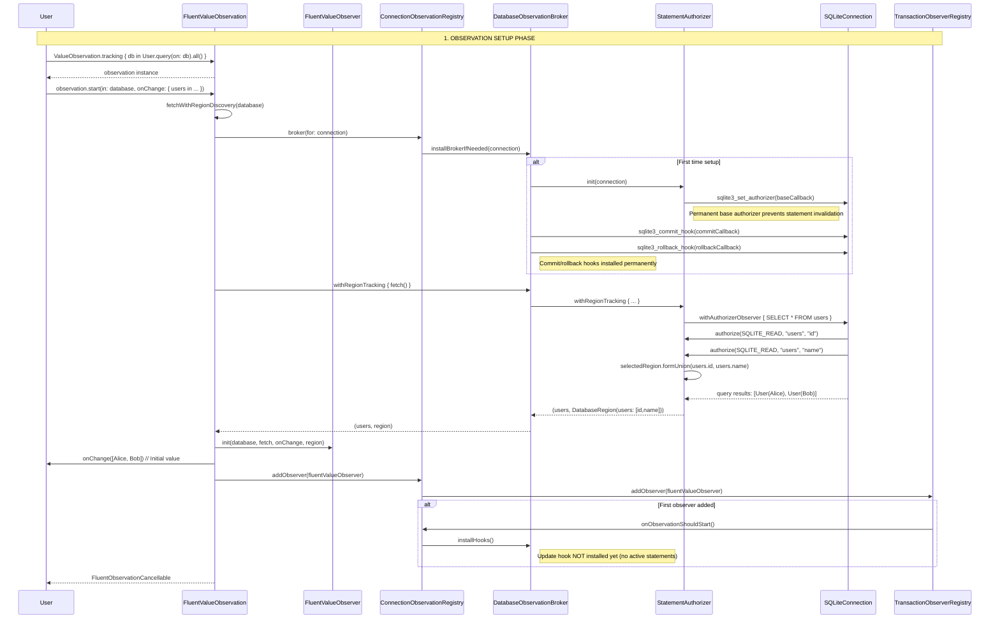
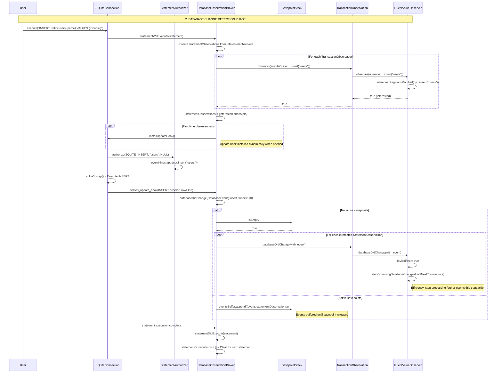
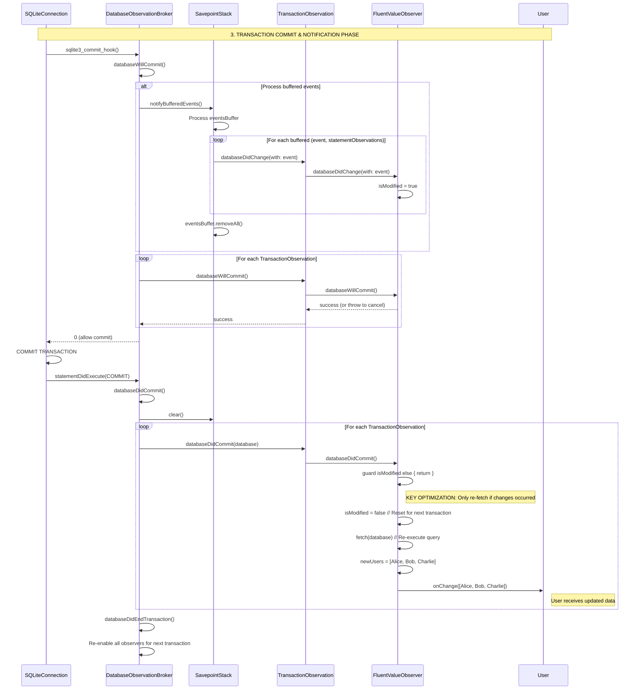
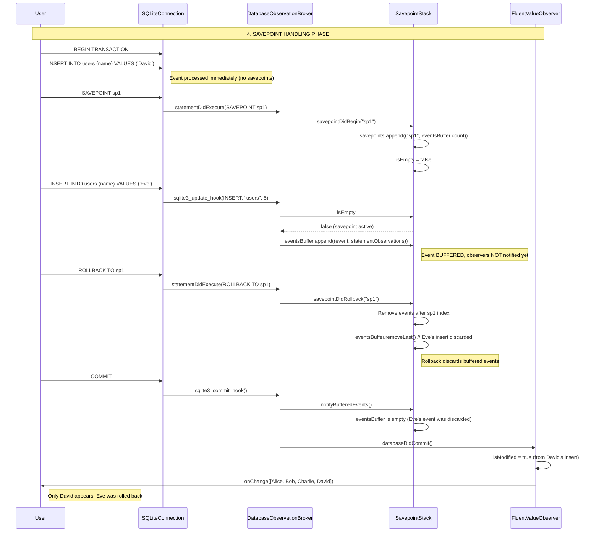
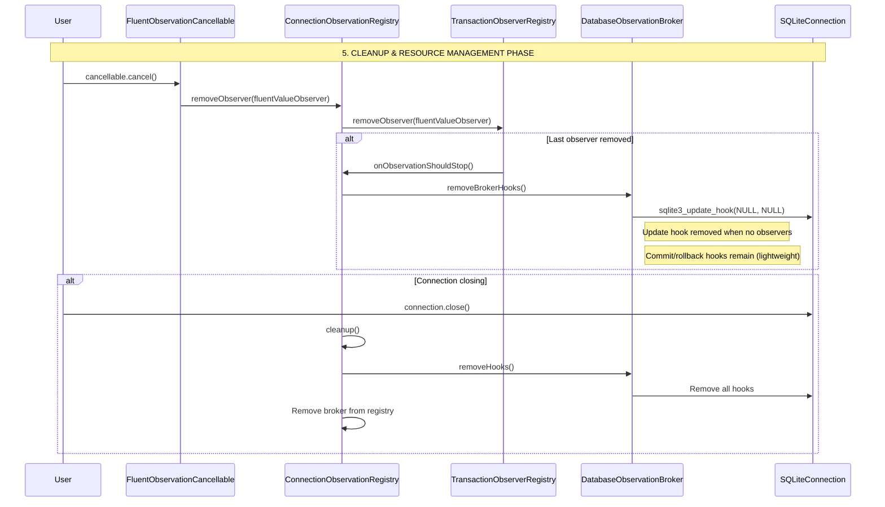

# FluentSQLiteObservation - Complete System Sequence Diagram

This diagram shows the complete flow of the FluentSQLiteObservation system when fully implemented, based on GRDB's proven patterns.

## 🚀 Phase 1: Database Connection & Observer Setup

## 📝 Phase 2: Database Change Detection & Event Processing

## 🔄 Phase 3: Transaction Commit & Observer Notification

## 🏗 Phase 4: Savepoint Handling (Nested Transactions)

## 🧹 Phase 5: Observer Cleanup & Resource Management

## 🎯 Key Performance Optimizations

### ✅ **Efficient Change Detection**
1. **`observes(eventsOfKind:)`** - Called once per statement to filter interested observers
2. **`isModified` flag** - Only re-fetch when relevant changes occurred
3. **`stopObservingDatabaseChangesUntilNextTransaction()`** - Prevents redundant event processing

### ✅ **Dynamic Hook Management**
1. **Update hook** - Only installed when observers exist (`statementObservations` not empty)
2. **Commit/rollback hooks** - Installed permanently (lightweight)
3. **Authorizer** - Permanent base + temporary overlay pattern

### ✅ **Transaction Safety**
1. **SavepointStack** - Buffers events during savepoints
2. **Event filtering** - Only interested observers notified
3. **Rollback handling** - Discards buffered events on rollback

### ✅ **Resource Efficiency**
1. **Weak references** - Prevent retain cycles in observer lifecycle
2. **Automatic cleanup** - Hooks removed when last observer removed
3. **Shared observations** - Multiple subscribers share single database query

## 🔧 Implementation Priority

1. **SavepointStack** - Critical for transaction correctness
2. **DatabaseEvent & TransactionObservation** - Core event system
3. **DatabaseObservationBroker hooks** - SQLite integration
4. **FluentValueObserver `isModified` pattern** - Performance optimization
5. **SharedValueObservation** - Resource sharing for multiple UI components

This sequence diagram shows the complete, efficient observation system that will be achieved when all TODOs are implemented, providing GRDB-level performance and correctness in FluentSQLiteObservation.
